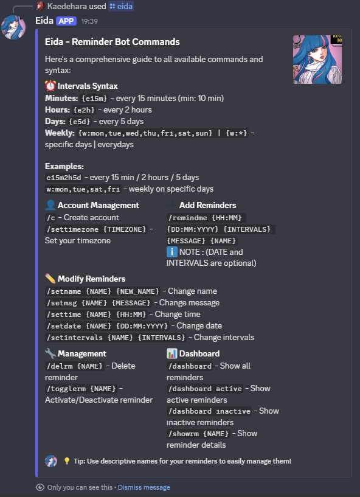
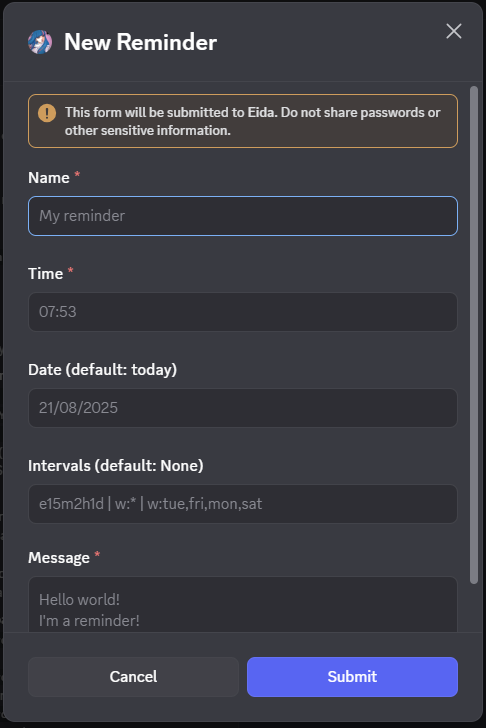

<h1 align="center">
    <br>
    
    <br>
    Eida
    <br>
</h1>
---
<h4 align="center">A minimalist discord bot reminder built with 
    <a href="https://discordpy.readthedocs.io/en/stable/" target="_blank">discord.py</a>.
</h4>

<p align="center">I built this personal project in order to put into practice my skills in Python and PostgreSQL by building a simple project that solves one of my problems. </p>

<p align="center">
  <a href="#key-features">Key Features</a> •
  <a href="#installation--setup">Installation & Setup</a> •
  <a href="#known-issues">Known Issues</a> •
  <a href="#license">License</a>
</p>





## Key Features

- Create and manage a personal account
- Set your timezone for accurate reminders
- Add or delete reminders
- Edit reminder detail (name, message, time, date, intervals)
- Toggle a reminder status
- View all reminders in a complete dashboard, or filter by active/inactive
- Display detailed information for a specific reminder

## Installation & Setup

To clone and run this application, you'll need Python and Pip.
From your command line :

```bash
# Clone the repo by running
git clone https://github.com/UnOrdinary95/Eida.git

# Go into the repository
cd Eida

# Install dependencies in a fresh virtual environment
python -m venv venv
venv\Scripts\activate # On Windows
source venv/bin/activate # On macOS/Linux
pip install -r requirements.txt

# Run the app
python -m src.server
```

> Make sure to create a `.env` file containing your Discord token and your PostgreSQL database credentials!

## Known Issues

None

## License

MIT
